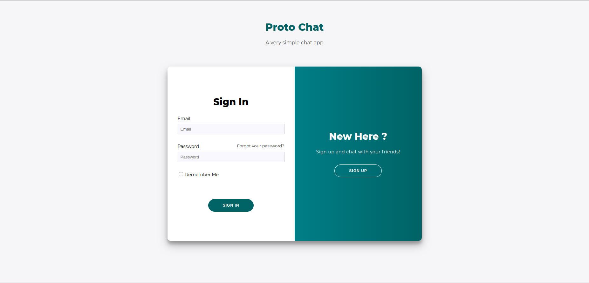
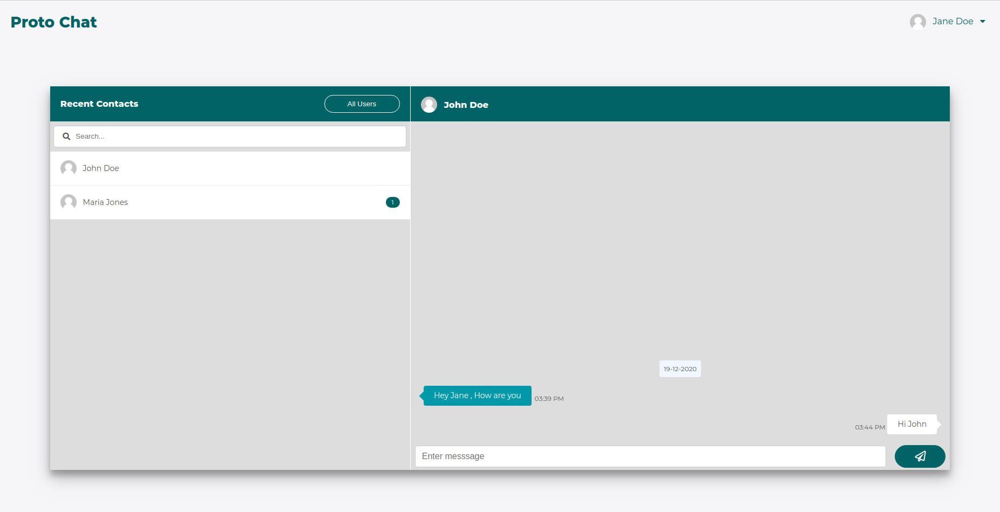
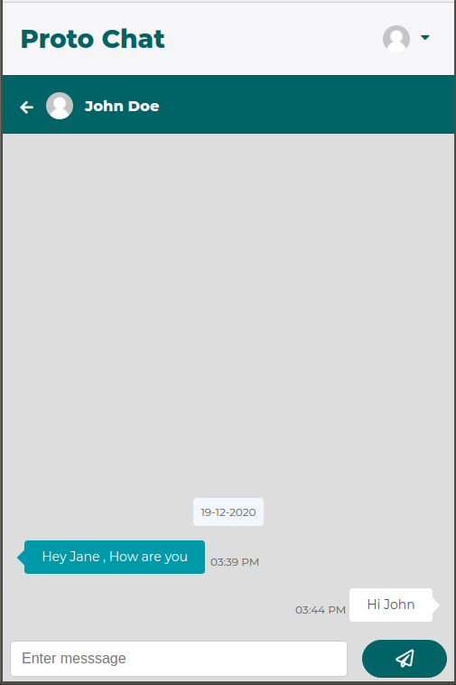
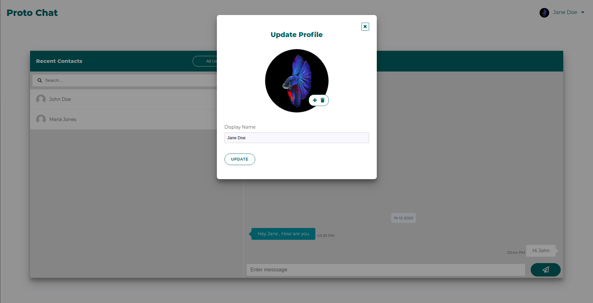

# Protochat

Protochat is a simple chat platform where user can create an account and chat with other users.

Build using

* Spring Boot
* ThymeLeaf
* Vanila Javascript
* MySql

Key Facts

* Real time communication ( via server ) is realized using plain websockets
* Messages are stored in server, inorder to view the chat history
* A mature authentication system is added using spring security
* Can add profile picture to make chats more interactive

Preview

* Login

  

* Chat Large Screen

  

* Chat Small Screen

  

* Profile

  

How to install

* Clone the project
* Import the project in your favourite IDE
* Set up mail in application.properties
* Create a new database in mysql, and set up datasource in application.properties
* Set `spring.datasource.initialization-mode` to `always` in application.properties
* Run the application
* After first run, set `spring.datasource.initialization-mode` to `none` in
